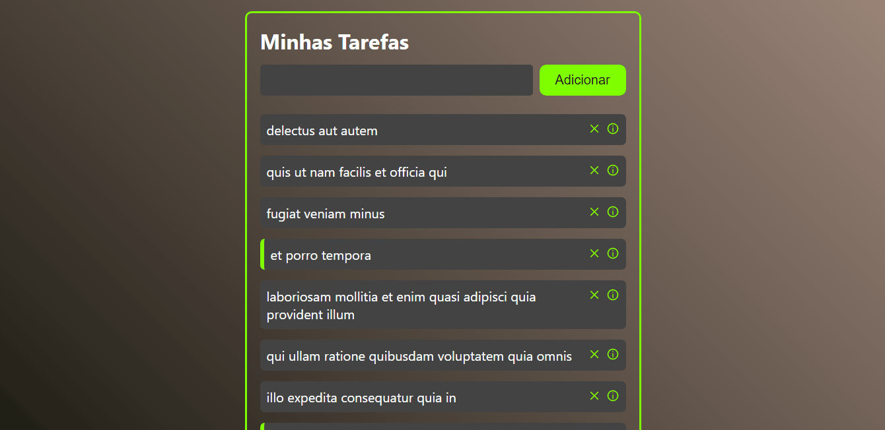

<h1 align="center">
    Lista de Tarefas em React
</h1>

 

## :camera: Demonstração

 <h1>Demo:</h1>
  

## :rocket: Tecnologias

Esse projeto foi desenvolvido com as seguintes tecnologias:

✔️React

✔️Styled Components

✔️React Router DOM

✔️Axios

## 💻 Projeto

Uma simples lista de tarefas integrada com uma api de tarefas.

<h1 align="center">O que aprendi 👨‍💻</h1>
<ul>
    <li>Funcionamento do ReactJS no geral </li>
    <li>Componentes no ReactJS</li>
    <li>Estados no ReactJS</li>
    <li>Axios para o consumo de API's</li>
    <li>React Router DOM para o uso de rotas single-page </li>
   
</ul>  

## ⚙ Configuração

1- Para instalar as dependências:

> npm install

2- Para iniciar a aplicação:

> npm start

---

Made with 💜 by João Artur 👋 See my <a href="https://www.linkedin.com/in/magalhesartur/">Linkedin</a>

